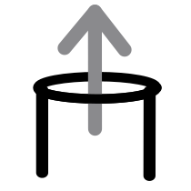

# MapLab  

***

[](https://circleci.com/gh/JoseHerminioCollas/map-lab)

Map Lab is a place to establish examples of web mapping libraries. 


## Installing

### Clone the repository
```
git clone https://github.com/JoseHerminioCollas/map-lab.git
```
### Install
```
npm install
```
### Start
```
npm run start
```
### Run the tests

```
npm run test
```

### Built With

```
npm run build
```

Map Lab is a place to establish examples of web mapping libraries. Currently, the libraries used are Google Maps Platform and Leaflet in the context of a React application.

A mapping library is not simple and can be thought of as an application within an application. To coordinate the various applications in a React application, a React's state needs to be the ultimate source of truth. There are many ways to do this currently, the application is unified with React hooks in a pattern called Control Status and is detailed below.

The application consists of two maps. Either map can be used to navigate the other. In the case of the application, one map is a Google map, and one is a Leaflet map. Setting the maps to different zoom levels, one can experiment with varying speeds of navigation. The application offers a way to compare the rendering of different map libraries side by side.

Often in client-side web development, the need arises in which distinct libraries with distinct event systems will have to be incorporated. Ideally, the application has a primary source of truth, while the other libraries follow the main application.

### License

This project is licensed under the MIT License - see the [LICENSE.md](LICENSE.md) file for details

### Acknowledgments

* Made with Create React App


[Status Control Pattern](status-control.md)

### Google map expects an API key 

Add a file in src/config/g-key.js
with the contents:

export default { gMapAPIKey: 'YOUR API KEY HERE' }
